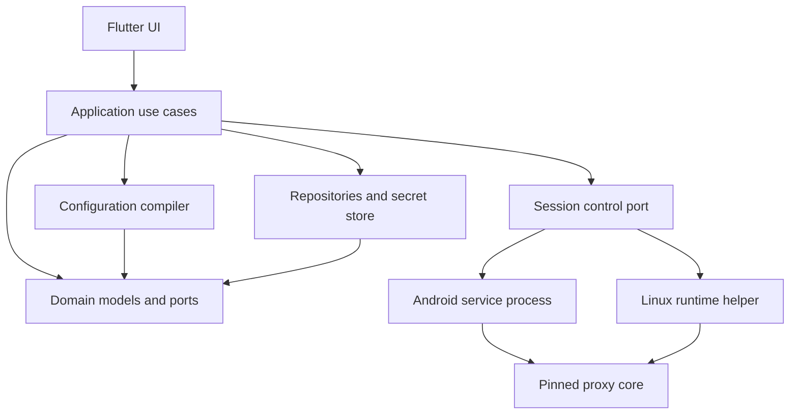

# Архитектура TrueTun

Статус: принято для проектирования; реализация перечислена отдельно в [baseline](architecture/01-baseline.md). Основная цель — независимый от ядра продукт с предсказуемой сетевой сессией на Android и Linux.

## 1. Границы продукта

Обязательное ядро продукта: одиночные VLESS-ссылки и подписки; TUN; упорядоченные правила proxy/direct/block; Android include/exclude; локальные рекомендации приложений; диагностика причин отказа. Поддержка других протоколов расширяется через verified capabilities. Никакая архитектура клиента сама по себе не гарантирует обход блокировок любой сети.

Не входят в первый выпуск: серверная панель, собственный proxy protocol, облачный аккаунт и синхронизация, прозрачная цепочка нескольких ядер, полный интерпретатор Mihomo, live-update binary ядра, FakeIP по умолчанию. Они не должны влиять на готовность базового пути.

## 2. Основная форма системы

Модульный монолит на Flutter/Dart с native runtime boundaries. Не создавать микросервисы и отдельный package на каждую сущность. Один исходный domain/compiler используется обеими платформами. Передача пакетов никогда не проходит через Dart, MethodChannel или UI state.

На диаграмме вызовы и границы исполнения; направление compile-time зависимости adapters/repositories — к domain ports, а не наоборот. Composition root выбирает реализации. Результат сборки зависит от platform/core manifest, но доменные правила не зависят от API sing-box.

## 3. Модули и владение

| Целевой каталог | Ответственность | Запрещено |
|---|---|---|
| `lib/src/app/` | Bootstrap, DI, navigation, общая тема | Бизнес-правила и runtime JSON |
| `lib/src/domain/` | IDs, модели, pure validation, repository/clock/secret ports | Flutter, dart:io, плагины, конкретная БД |
| `lib/src/application/` | Import, update, connect plan, routing edits, snapshot assembly | Прямые shell/root операции |
| `lib/src/features/` | Экраны, view models, локальное presentation state | Доступ к core config и секретам без отдельного use case |
| `lib/src/infrastructure/persistence/` | SQLite adapter, migrations, transactions | Самостоятельное применение VPN настроек |
| `lib/src/infrastructure/import/` | HTTP/parser adapters и normalizers | Запуск входящего native config |
| `lib/src/infrastructure/core/` | Capabilities registry, compiler backend, lifecycle facade | Скрытое изменение пользовательского policy |
| `lib/src/infrastructure/platform/` | Android bridge, Linux IPC, apps/network providers | Дублирование бизнес-правил |
| `lib/src/infrastructure/diagnostics/` | Redaction, bounded logs, bundles | Неограниченный packet capture |
| `android/` | Kotlin service, AIDL/native integration, FD/network ownership | Flutter business state как источник истины VPN |
| `native/linux/` | Go helper, supervisor, Polkit/D-Bus, system resources | Произвольное исполнение команд клиента |
| `test/`, `integration_test/` | Pure/contract/widget/device проверки | Production credentials |

Каталоги целевые, сейчас не созданы. Сохранить существующие filenames до задачи на постепенный перенос. Pure Dart compiler может быть выделен в package только если появляется второй потребитель или необходимость enforce boundary.

## 4. Технические решения

Flutter сохраняется. Предложены Riverpod для DI/presentation state, Drift поверх SQLite для транзакционных данных, Pigeon для типизированного UI-native bridge; версии выбрать и pin в T01 по совместимости SDK. Domain не знает об этих библиотеках. Для Android выбрать Kotlin и mobile library выбранного ядра. Для Linux предложен Go helper: удобен для связи с Go core ecosystem и системных API, но он отдельный production component со строгим API.

Baseline ядра — точная стабильная сборка upstream sing-box, выбранная в T00, а не плавающий latest. Extended backend — отдельный compiler/manifest и отдельная матрица испытаний. Возможность XHTTP не доказывается словом «sing-box-compatible». Замена backend может потребовать полного restart, а несовместимые узлы остаются сохранёнными с объяснением.

## 5. Потоки данных

**Импорт:** input → ограниченный parser → ImportDraft с диагностикой → preview → transaction → normalized entities + encrypted secret refs. Сетевой профиль не управляет native inbounds, root flags, путями и lifecycle.

**Подключение:** repository read transaction → ConnectionSnapshot → semantic validation → capabilities validation → deterministic compile → platform/core validation → supervisor commit → readiness → active revision.

**Изменение правил:** editor draft → pure validation → save desired revision → показать diff с active → Apply → новый plan. Сохранённое изменение не означает применённое изменение. UI явно показывает pending changes.

**Обновление подписки:** новый candidate → reconcile IDs → проверить references → transaction desired data. Работающая сессия продолжает использовать immutable старый snapshot; переключение выполняет supervisor по отдельной политике. Обновление в фоне не прекращает работающие потоки само по себе.

## 6. Авторитет состояния

SQLite — источник пользовательской конфигурации; runtime supervisor — источник фактического состояния соединения. UI read models — проекции. Native service хранит ограниченный recovery capsule для восстановления без Flutter; он не редактирует подписки и database entities. Recovery capsule связан с snapshot hash и version, его нельзя использовать после отзыва согласия, несовместимой схемы или явного Disconnect.

Supervisor serializes все lifecycle команды, включая уведомление, tray, UI, network changes, service restart. Не создавать независимый контроллер reconnect в виджете или background worker.

## 7. Ключевые качественные свойства

- Crash-safe ресурсы, ограниченные retries, явная degraded/failed диагностика.
- Offline restart последнего валидного плана без загрузки GeoIP/подписки при каждой кнопке Connect.
- Точная маршрутизация: no silent drop, stable IDs, differential compiler tests.
- Приватность: inventory apps локально, секреты в защищённом хранилище, redacted-by-default export.
- Расширяемость через ports и capabilities, а не «универсальный map» во всех слоях.
- Наблюдаемость: correlated operation/session/revision IDs без credentials.

Подробные контракты и failure scenarios обязательны: [данные](architecture/02-domain-data.md), [API](architecture/03-contracts.md), [lifecycle](architecture/04-session-lifecycle.md). Решения с альтернативами и gates: [ADR](architecture/11-decisions.md).
