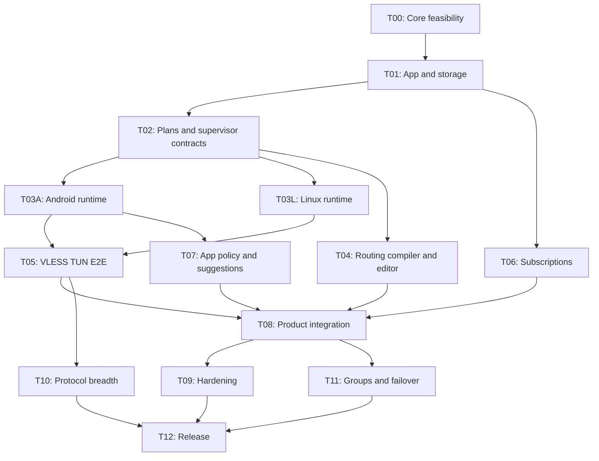

# План реализации TrueTun для ИИ-агентов

Статус всех задач ниже — **не выполнено в рамках этого документационного пакета**. Частичные исходные компоненты перечислены в baseline. План задаёт зависимости и проверяемые результаты, а не разрешает автоматически писать приложение целиком. Каждый этап выполнять отдельным поручением/ограниченным PR.

## Milestones

| Milestone | Состав | Пользовательский результат |
|---|---|---|
| M0: доказанная основа | T00, T01, T02 | Зафиксированные capabilities/контракты, хранилище и полный проверяемый plan |
| M1: одна реальная ссылка | T03A, T03L, T05 | VLESS TUN + DNS, Connect/Stop, recovery на обеих платформах |
| M2: личный рабочий клиент | T04, T06, T07, T08 | Подписки, editor rules, Android app lists и suggestions, usable UI |
| M3: расширение | T10, T11 | Другие protocols, XHTTP если gate пройден, groups/failover |
| M4: выпуск | T09, T12 | Device evidence, signing/package/migration и документированные ограничения |

DNS baseline, secrets/redaction и lifecycle failure handling входят в M0/M1. T09 углубляет проверки, не откладывает всю надёжность до конца. XHTTP investigation начинается T00, чтобы не обнаружить неподходящий backend после создания всего UI.

## Зависимости

T10/T11 не обязательны для узкого VLESS-only первого выпуска: T12 может исключить их features из обещаний и support matrix. Полный M3/M4 scope должен быть явно выбран. Diagram не поручает параллельную работу.

## T00 — Feasibility и pin ядра

Вход: baseline, PROTOCOLS, ADR-002/009/010. Результат: exact source commit/version/build flags/ABI; capabilities evidence; Android binding signatures/FD/protect contract; Linux TUN ownership proof; XHTTP options report; SDK proposal. Первым PR может быть только исследование и fixtures plan, если реализация ещё не поручена. При порученной реализации disposable proof-of-concept не выдавать production кодом.

Подзадачи: T00.1 сравнить точные builds; T00.2 Android API spike; T00.3 Linux FD/helper feasibility; T00.4 logical-rule truth tables; T00.5 dependency/license inventory. DoD: воспроизводимая команда/check evidence или точный blocker и ADR alternative. Не брать latest на веру, не менять GUI/лицензию.

## T01 — Foundation, IDs и storage

Зависит T00. Создать native Flutter shells контролируемым diff; pin SDK/dependencies, выбрать Riverpod/Drift/Pigeon или обосновать замену. Внедрить domain IDs/unions/ports, SQLite v1, encrypted secret store, CAS revisions, app composition root. Разделить текущую app policy и serialization. Не перестраивать все экраны.

DoD: startup/read/write на обеих платформах; restart сохраняет профиль; секрет отсутствует в SQLite plaintext/logs; CAS conflict и pending secret crash recovery; analyze/tests. Отдельный PR для generated shells, чтобы review не терял смысл за generated diff.

## T02 — Compiler snapshot и lifecycle contracts

Зависит T01. Реализовать immutable snapshot assembler, build capability report, complete minimal config plan (VLESS node, direct, TUN intent, DNS baseline, final route), secret materializer и runtime port. Ввести supervisor state machine/test double и structured errors. Текущий Process adapter обернуть development facade, устранить false ready и unbounded stop в своей задаче.

DoD: deterministic plan, missing references/capabilities fail before start, exact core check, concurrency traces SES-01 в fake runtime, safe errors/redaction. Native TUN readiness пока не считается реализованной.

## T03A — Android integration

Зависит T02 и Android gate T00. Подзадачи: manifest/consent/notification; private IPC и service process; native core/protect/FD; inspect/rebind/recovery capsule; network callbacks/stop/revoke. Реализовать минимальный empty-list guard уже здесь, даже до UI app picker.

DoD: сервис стартует/останавливается с one-node test plan, notification Stop работает, UI kill не теряет state, revoke не вызывает loops, descriptor cleanup проверен. Physical Android evidence; emulator-only работу пометить incomplete для release.

## T03L — Linux integration

Зависит T02 и Linux gate T00. Подзадачи: typed helper IPC/Polkit; verified worker artifact; TUN/DNS ownership; resource journal/reconcile; current-user isolation; native install manifest. Непривилегированный GUI сохраняется.

DoD: TUN start/stop с тестовым plan; denied action безопасен; crash cleanup не трогает чужие resources; controlled DNS restore; fixed binary/hash. Dev mixed proxy не закрывает этот этап.

## T04 — Routing и rule sets

Зависит T02; runtime semantic verification после T03. Подзадачи: AST/reference evaluator; exact backend logical compiler; scope/capability validation; ordered editor+final action; source↔generated mapping; bounded rule-set manager; Mihomo subset importer.

DoD: RTE-01..05; no silent field drop; stable NodeId/GroupId; cached asset offline connect; corrupted update сохраняет active asset. Rule-set network fetch не входит compiler. Basic rule editor достаточно сначала для domain/CIDR/port; остальные predicates включаются только по evidence.

## T05 — VLESS end-to-end

Зависит T03A/T03L, minimal compiler T02. Исправить VLESS ambiguous/unknown fields по fixture contract. Соединить paste→preview→save→select→Connect→Stop. DNS bootstrap, IPv6 policy, local readiness и health diagnostics включены сразу.

DoD: IMP-01/02/03, DNS-01/02, SES-01/02 на устройствах; captured test app TCP/DNS/UDP в обе стороны; 30 min transfer; Wi-Fi change; no false Connected. Одной Reality TCP комбинации достаточно для первого среза; WS/gRPC/HTTPUpgrade проверяются отдельными последующими tasks, не обещаются автоматически.

## T06 — Subscriptions

Зависит T01/T02; UI integration после T05. Реализовать bounded HTTP, plain/base64 lists, затем nodes-only JSON/YAML; ImportDraft, ETag/metadata, stable reconcile и transactional commit. Вынести each external format в отдельный adapter PR. Background fetch route явно задан.

DoD: SUB-01..03, IMP-04; URL/token не выводится; partial/empty/invalid update не стирает data; 1 000 nodes measured; active snapshot не меняется без Apply. Не добавлять arbitrary native config mode.

## T07 — Android apps и suggestions

Зависит T03A, storage T01. Package identity/inventory, icon cache, mode preview, effective list validation, apply via controlled restart. Local hints providers и explainable suggestions с ручным подтверждением. Advanced package routing только после capability из T04.

DoD: AND-01/03, empty include/last uninstall/mode conversion; explicit user choice сохраняется; no inventory network upload; excluded-app block conflict виден. System/category heuristic не применяет правила автоматически.

## T08 — Product integration

Зависит T04/T05/T06/T07. Соединить все read models со screens; desired/active indicators; RU/EN, adaptive layouts, safe-area, errors, keyboard/accessibility, logs/export. Manual group минимум, test selected node через реальный outbound.

DoD: UX-01 и пользовательский путь M2 на Android/Linux; no placeholder success; restart/rebind корректен; redacted bundle проходит SEC-01. Не менять дизайн целиком под предлогом state refactor.

## T09 — Reliability и измерения

Зависит T08. Расширить fault tests, migrations, concurrency, crash recovery, DNS/IPv6 captures, 100 cycles, 8 h idle; измерить budgets и исправить найденные проблемы. Always-on/kill-switch включать только отдельным доказанным scope; иначе честно unavailable.

DoD: acceptance matrix содержит actual evidence/known failures; no unexplained FD/process growth; packet capture соответствует policy; secrets не утекли. Не понижать защиту ради throughput benchmark.

## T10 — Протоколы и extended backend

Зависит T05 и capability gate T00. Каждый protocol/transport — свой vertical PR по PROTOCOLS. Начать Trojan/Shadowsocks/VMess/Hysteria2/TUIC по выбранному приоритету, XHTTP отдельным build/API/licensing gate. WireGuard/AWG/AnyTLS — последующие срезы.

DoD: parser+storage+compiler+core check+platform E2E на каждую claimed tuple. Unsupported сохраняется importOnly. Не делать silent backend switch и не добавлять несколько concurrent cores без ADR.

## T11 — Groups и failover

Зависит T08. Manual selection, verified dynamic selector, health strategy owner, probe budgets, hysteresis и fallback. Начать без nested groups; при расширении cycle detection.

DoD: failed current member переводит в eligible node по policy, no node flapping, empty group не DIRECT, UI показывает реальный member, subscription refresh не рушит pinned group semantics.

## T12 — Packaging и выпуск

Зависит T09, плюс T10/T11 только для заявляемых расширений. Project-owner license decision, pinned manifest/SBOM/notices, Android signing, Linux packages/helper lifecycle, install/upgrade/uninstall, release evidence. Не публиковать binary без соответствующего поручения.

DoD: clean install и upgrade с secrets/migrations; rollback compatibility; supported matrix attached; known limitations пользователю; reproducible source→artifact identity. Название релиза не заменяет Android versionCode или internal schema versions.

## Шаблон проверки завершения этапа

Записать: task IDs; baseline и result commit; changed interfaces/schema; список acceptance IDs с pass/fail/not-run; evidence paths; remaining blockers; следующий ровно один рекомендуемый task. Если gate blocked, не продвигать milestone в completed по наличию scaffold.
