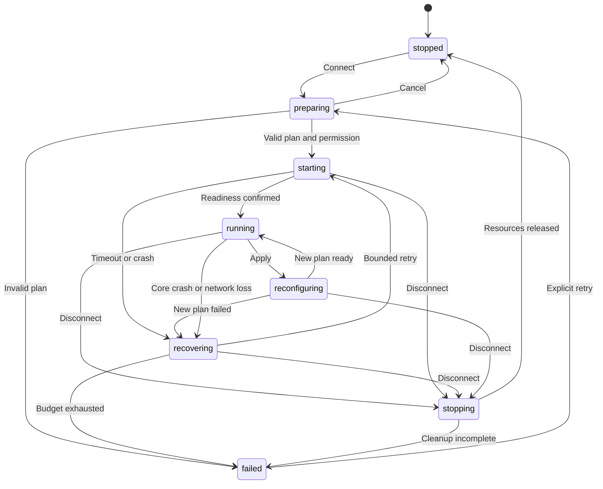

# 04. Соединение, конкуренция и восстановление

Главный владелец — runtime supervisor, живущий независимо от UI. Application формирует намерение, supervisor владеет процессом ядра и ресурсами. Domain state не должен дублировать скрытую native state machine.

## Состояния

Health (healthy/degraded/unknown) отдельно от lifecycle. `running` означает готовый local dataplane/TUN, но не гарантирует доступность каждого сайта. Контрольный probe проверяет выбранный outbound, DNS и HTTP; провал одного публичного URL делает degraded, а не бесконечный restart. При отсутствии протокола проверки готовности использовать связку native TUN acknowledgement + core control handshake; строка stdout и Process.start недостаточны.

## Запуск

1. Захватить lifecycle queue; назначить operation/session generation. Установить desiredConnected=true.
2. Assemble snapshot, pin assets и secret versions; проверить graph/groups/platform/capabilities. В UI — preparing.
3. Материализовать protected temporary config, выполнить check exact binary; ошибки не затрагивают действующую сеть.
4. Проверить разрешения/underlying network; подготовить платформенный plan и tickets. После permission dialogue перечитать актуальную revision.
5. Выполнить commit. Android service устанавливает TUN и передаёт FD mobile core согласно binding contract; Linux helper создаёт ресурсы согласно единственному выбранному ownership mode.
6. Дождаться local readiness. После этого сохранить activeRevision и last-known-good capsule, emit PlanApplied. Отдельно запустить end-to-end health probe.
7. Освободить неподключённые candidates; хранить assets активного и последнего пригодного recovery плана.

Если ошибка после частичного создания ресурсов — cleanup в обратном порядке с ownership checks. После cleanup inspect обязан показать фактическое состояние. Ошибка cleanup не маскируется как stopped.

## Apply и rollback

Saved desiredRevision и activeRevision различаются. Новые настройки без Apply не влияют на dataplane. Для обычной смены rules/DNS/app filter v1 использует validate-before-break и controlled restart. Не обещать бесшовность: старые TCP/UDP flows могут оборваться. Два TUN/core с конкурирующими маршрутами одновременно не запускать.

Prepare candidate, пока old session работает. Если check не прошёл, old не останавливается. Затем stop old → start candidate → local readiness → persist new active. Если candidate не готов, освободить его ресурсы и попытаться восстановить old capsule с актуальными PlatformFacts; generation новая. Если old тоже не стартует — failed(ROLLBACK_FAILED), не переключаться на другой policy или DIRECT. Rollback не восстанавливает уже потерянные сетевые потоки.

Dynamic selector change допустим только для verified backend API; user sees whether existing flows retain old outbound. Hot reload расширяется отдельной capability с собственными integration tests, а не по совпадению имени команды.

## Конкурентные операции

Все lifecycle operations сериализованы. Last desired intent может коалесцироваться до commit; начавшийся commit завершается или останавливается через безопасный cancellation point. Повторный Connect той же revision идемпотентен. Connect(B) во время start(A): зафиксировать B как pending, A не может поздним Ready перезаписать B. Stop всегда очищает desiredConnected и cancel token для retries. Network callback никогда самостоятельно не вызывает второй start.

Subscription refresh, app inventory updates и rule-set downloads не держат lifecycle mutex во время HTTP. После загрузки compare-and-swap revision; устаревший plan получает STALE_PLAN. Old process exit очищает только ресурсы своего sessionId; PID re-use предотвращается handle/start-time identity.

## Восстановление

Предлагаемый retry budget: максимум 3 старта за 60 s, задержки 1/2/4 s с jitter до 20%, затем failed с ручным Retry. No underlying network переводит в recovering/waiting и не расходует crash budget до network-available; ожидание отменяется Stop. Успешная стабильная минута сбрасывает budget. Ошибки парсинга, capabilities, permission revoke и locked key store не повторяются автоматически.

Android service может восстановить последний разрешённый capsule после UI process death; reboot/always-on — отдельный явно включённый режим. UI restart всегда inspect. Linux helper продолжает сессию после закрытия окна, если пользователь выбрал работу в фоне; Quit-and-disconnect — отдельное действие. После helper/core crash reconcile только собственные ресурсы.

## Failure policy

Разделять `restoreSystemNetwork` (после отказа удалить свои VPN routes) и `blockOnFailure` (сохранить явно предусмотренную блокировку). Default v1 — restoreSystemNetwork с понятным UX; режим блокировки не объявлять работающим до platform gate. Это означает, что после падения VPN приложения могут пойти напрямую; UI должен описывать режим до включения.

Android block-on-failure опирается на проверенный системный always-on/lockdown сценарий; простой захват FD не обещает kill switch. Linux блокировка требует принадлежащих helper правил и отдельного восстановления; отсутствие core `strict_route` само по себе не является kill switch. Пользовательский Disconnect завершает политику приложения, но не может отменять Android системный lockdown. Исключённые Android apps не входят в гарантию защиты TrueTun.

## Обязательные трассы

Connect→Stop до permission result; Stop во время check/start; двойной Connect; старый Exit после нового Ready; apply malformed config; candidate start fail + rollback success/fail; key store locked после reboot; Wi-Fi→mobile; helper/UI crash; full disk при capsule save. Для каждой трассы проверять одну активную generation, нулевые чужие resource mutations и корректную activeRevision.
